# lab4web
TUGAS PERTEMUAN 5

PEMROGRAMAN WEB

TEKNIK INFORMATIKA

UNIVERSITAS PELITA BANGSA

NAMA  : Andre mahadi

NIM   : 312110221

KELAS : TI.22.B1

DOSEN : Agung Nugroho,S.Kom.,M.Kom

# Pemrograman Web: CSS Layout

Instruksi Praktikum
1. Persiapkan text editor misalnya VSCode.
2. Buat folder baru dengan nama Lab4Web
3. Ikuti langkah-langkah praktikum yang akan dijelaskan berikutnya.
4. Lakukan validasi dokumen html dengan mengakses http://validator.w3.org

**Langkah-langkah Praktikum**<br>

Persiapan membuat dokumen HTML dengan nama file lab4_box.html seperti berikut.<br>
```
<!DOCTYPE html>
<html lang="en">
<head>
 <meta charset="UTF-8">
 <meta name="viewport" content="width=device-width, initial-scale=1.0">
 <title>Box Element</title>
</head>
<body>
 <header>
 <h1>Box Element</h1>
 </header>
</body>
</html>
```
**Membuat Box Element**<br>
Kemudian tambahkan kode untuk membuat box element dengan tag div seperti berikut.<br>
```
<section>
 <div class="div1">Div 1</div>
 <div class="div2">Div 2</div>
 <div class="div3">Div 3</div> 
</section>
```
**CSS Float Property**<br>

Selanjutnya tambahkan deklarasi CSS pada head untuk membuat float element, seperti berikut.<br>
```
<style>
 div {
 float:left;
 padding: 10px; 
 }
 .div1 {
 background: red;
 }
 .div2 {
 background: yellow;
 }
 .div3 {
 background: green;
 }
</style>
```

Berikut tampilan pada Browser :

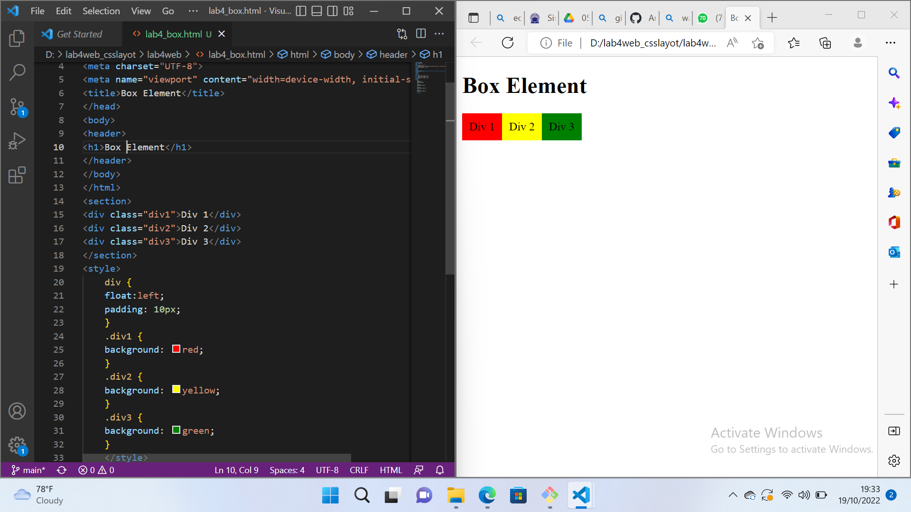


**Box Element Float**<br>

**Clearfix** digunakan untuk mengatur element setelah float element. Property clear digunakan untuk 
mengaturnya.<br>

Tambahkan element div lainnya seteleah div3 seperti berikut.<br>
```
<section>
 <div class="div1">Div 1</div>
 <div class="div2">Div 2</div>
 <div class="div3">Div 3</div> 
 <div class="div4">Div 4</div> 
</section>
```
Kemudian atur property clear pada CSS, seperti berikut.<br>
```
.div4 {
 background-color: blue;
 clear: left;
 float: none;
}
```

Selanjutnya buka browser dan refresh kembali.<br>

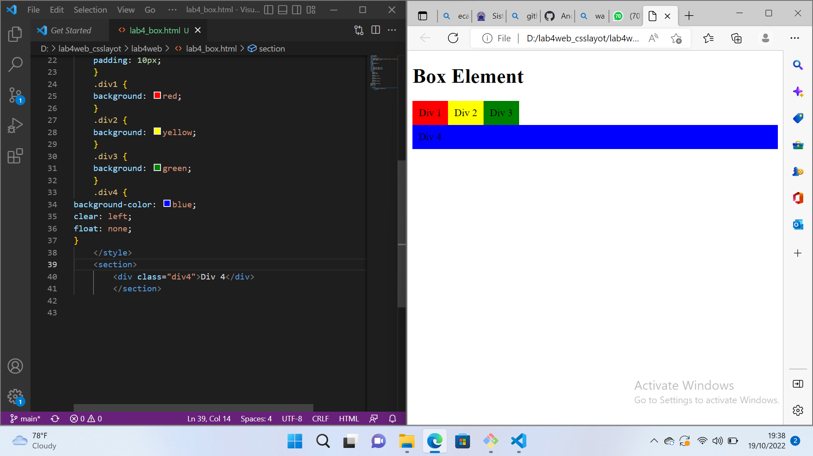


Buat **folder baru** dengan nama **lab4_layout**, kemudian buatlah file baru didalamnya dengan nama 
**home.html**, dan file css dengan nama **style.css**.<br>
```
<!DOCTYPE html>
<html lang="en">
<head>
<meta charset="UTF-8">
 <meta name="viewport" content="width=device-width, initial-scale=1.0">
 <title>Layout Sederhana</title>
 <link rel="stylesheet" href="style.css">
</head>
<body>
 <div id="container">
 
 </div>
</body>
</html>
```

Kemudian tulis kode berikut.<br>
```
<header>
 <h1>Layout Sederhana</h1>
</header>
<nav>
 <a href="home.html" class="active">Home</a>
 <a href="artikel.html">Artikel</a>
 <a href="about.html">About</a>
 <a href="kontak.html">Kontak</a>
</nav>
<section id="hero"></section>
<section id="wrapper">
 <section id="main"></section>
 <aside id="sidebar"></aside>
</section>
<footer>
 <p>&copy; 2021 - Universitas Pelita Bangsa</p>
</footer>
```

Kemudian buka browser dan lihat hasilnya.<br>

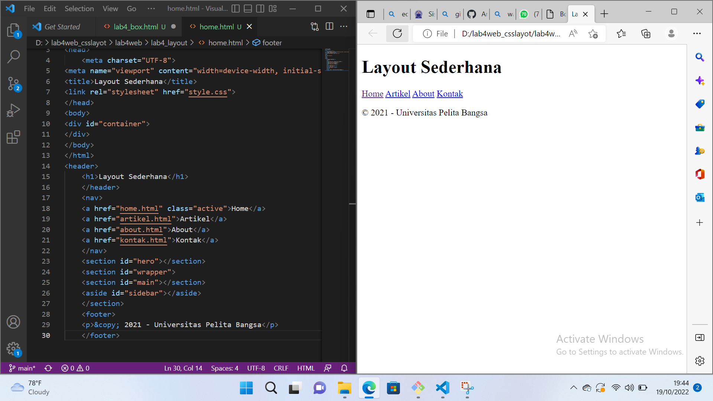

Gambar 05.Tampilan Kerangka Layout

Kemudian tambahkan kode CSS untuk membuat layoutnya.<br>
```
/* import google font */
@import
url('https://fonts.googleapis.com/css2?family=Open+Sans:ital,wght@0,300;0,400
;0,600;0,700;0,800;1,300;1,400;1,600;1,700;1,800&display=swap');
@import
url('https://fonts.googleapis.com/css2?family=Open+Sans+Condensed:ital,wght@0
,300;0,700;1,300&display=swap');
/* Reset CSS */
* {
 margin: 0;
 padding: 0;
}
body {
 line-height:1;
 font-size:100%;
 font-family:'Open Sans', sans-serif;
 color:#5a5a5a;
}
#container {
 width: 980px;
 margin: 0 auto;
 box-shadow: 0 0 1em #cccccc;
}
/* header */
header {
 padding: 20px;
}
header h1 {
 margin: 20px 10px;
 color: #b5b5b5;
}
```


Kemudian lihat hasilnya pada browser<br>
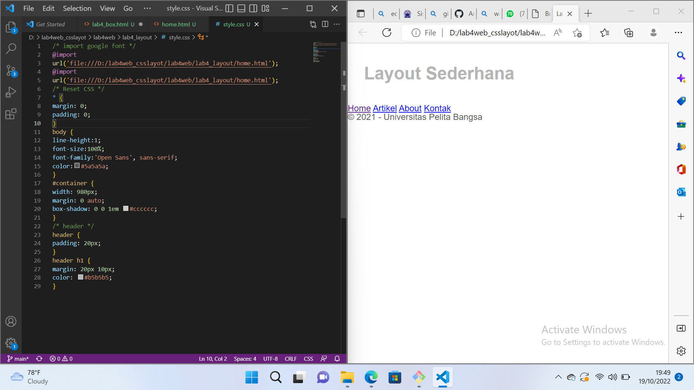

Gambar 06.Tampilan Header Layout

**Membuat Navigasi**

Kemudian selanjutnya mengatur navigasi.<br>
```
/* navigasi */
nav {
 display: block;
 background-color: #1f5faa;
}
nav a {
 padding: 15px 30px;
 display: inline-block;
 color: #ffffff;
 font-size: 14px;
 text-decoration: none;
 font-weight: bold;
}
nav a.active,
nav a:hover {
 background-color: #2b83ea;
}
```

Kemudian lihat hasilnya.<br>

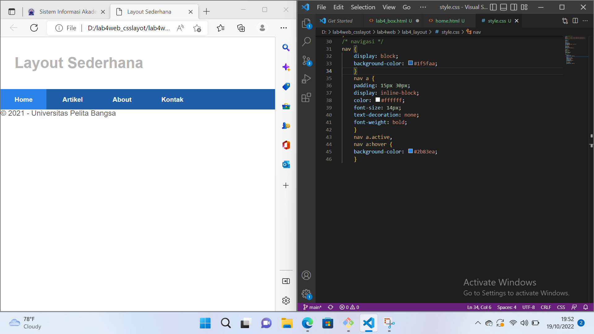

Gambar 07.Tampilan navigasi

**Membuat Hero Panel**<br>
Selanjutnya membuat hero panel. Tambahkan kode HTML dan CSS seperti berikut.<br>
```
<section id="hero">
 <h1>Hello World!</h1>
 <p>Lorem ipsum dolor sit amet, consectetur adipiscing elit. Vestibulum lorem 
elit, iaculis innisl volutpat, malesuada tincidunt arcu. Proin in leo fringilla, 
vestibulum mi porta, faucibus felis. Integer pharetra est nunc, nec pretium nunc 
pretium ac.</p>
 <a href="home.html" class="btn btn-large">Learn more &raquo;</a>
</section>
```

```
/* Hero Panel */
#hero {
 background-color: #e4e4e5;
 padding: 50px 20px;
 margin-bottom: 20px;
}
#hero h1 {
 margin-bottom: 20px;
 font-size: 35px;
}
#hero p {
 margin-bottom: 20px;
 font-size: 18px;
 line-height: 25px;
}
```

Berikut tampilan pada Browser :<br>

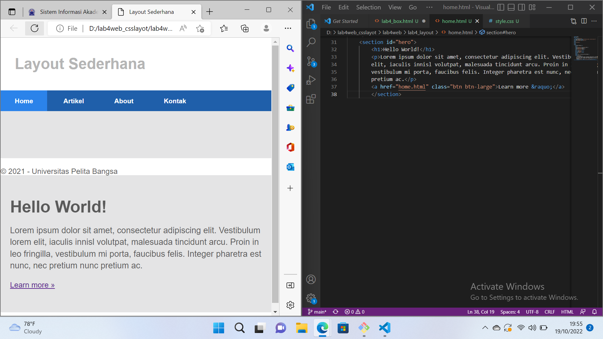

Gambar 08.Tampilan Hero Panel.

**Mengatur Layout Main dan Sidebar**<br>
Selanjutnya mengatur main content dan sidebar, tambahkan CSS float.<br>
```
/* main content */
#wrapper {
 margin: 0;
}
#main {
 float: left;
 width: 640px;
 padding: 20px;
}
/* sidebar area */
#sidebar {
 float: left;
 width: 260px;
 padding: 20px;
}
```

**Membuat Sidebar Widget**<br>
Kemudian selanjutnya menambahkan element lain dalam sidebar. <br>
```
<aside id="sidebar">
 <div class="widget-box">
 <h3 class="title">Widget Header</h3>
 <ul>
 <li><a href="#">Widget Link</a></li>
 <li><a href="#">Widget Link</a></li>
 <li><a href="#">Widget Link</a></li>
 <li><a href="#">Widget Link</a></li>
 <li><a href="#">Widget Link</a></li>
 </ul>
 </div>
 <div class="widget-box">
 <h3 class="title">Widget Text</h3>
 <p>Vestibulum lorem elit, iaculis in nisl volutpat, malesuada tincidunt 
arcu. Proin in leo fringilla, vestibulum mi porta, faucibus felis. Integer 
pharetra est nunc, nec pretium nunc pretium ac.</p>
 </div>
</aside>
```

Kemudian tambahkan CSS.<br>
```
/* widget */
.widget-box {
 border:1px solid #eee;
 margin-bottom:20px;
}
.widget-box .title {
 padding:10px 16px;
 background-color:#428bca;
 color:#fff;
}
.widget-box ul {
 list-style-type:none;
}
.widget-box li {
 border-bottom:1px solid #eee;
 }
.widget-box li a {
 padding:10px 16px;
 color:#333;
 display:block;
 text-decoration:none;
}
.widget-box li:hover a {
 background-color:#eee;
}
.widget-box p {
 padding:15px;
 line-height:25px;
}
```


Berikut tampilan pada Browser :<br>

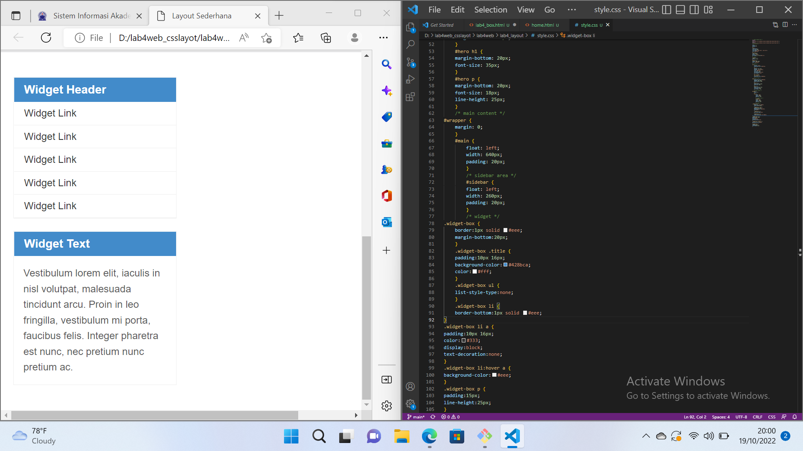

Gambar 09.Tampilan Sidebar Widget

**Mengatur Footer**<br>
Selanjutnya mengatur tampilan footer. Tambahkan CSS untuk footer.<br>
```
/* footer */
footer {
 clear:both;
 background-color:#1d1d1d;
 padding:20px;
 color:#eee;
}
```

Berikut tampilan pada Browser :<br>


Gambar 10.Tampilan Footer

**Menambahkan Elemen lainnya pada Main Content**<br>
```
<section id="main">
 <div class="row">
 <div class="box">
 
 <h3>Heading</h3>
 <p>Donec sed odio dui. Etiam porta sem malesuada magna mollis 
euismod.</p>
 <a href="#" class="btn btn-default">View detail</a>
 </div>
 <div class="box">
 
 <h3>Heading</h3>
 <p>Donec sed odio dui. Etiam porta sem malesuada magna mollis 
euismod.</p>
 <a href="#" class="btn btn-default">View detail</a>
 </div>
 <div class="box">
 
 <h3>Heading</h3>
 <p>Donec sed odio dui. Etiam porta sem malesuada magna mollis 
euismod.</p>
 <a href="#" class="btn btn-default">View detail</a>
 </div>
 </div>
</section>
```

Kemudian tambahkan CSS.<br>
```
/* box */
.box {
 display:block;
 float:left;
 width:33.333333%;
 box-sizing:border-box;
 -moz-box-sizing:border-box;
 -webkit-box-sizing:border-box;
padding:0 10px;
 text-align:center;
}
.box h3 {
 margin: 15px 0;
}
.box p {
 line-height: 20px;
 font-size: 14px;
 margin-bottom: 15px;
}
box img {
 border: 0;
 vertical-align: middle;
}
.image-circle {
 border-radius: 50%;
}
.row {
 margin: 0 -10px;
 box-sizing: border-box;
 -moz-box-sizing: border-box;
 -webkit-box-sizing: border-box;
}
.row:after, .row:before,
.entry:after, .entry:before {
 content:'';
 display:table;
}
.row:after,
.entry:after {
 clear:both;
}
```

Berikut tampilan pada Browser :<br>

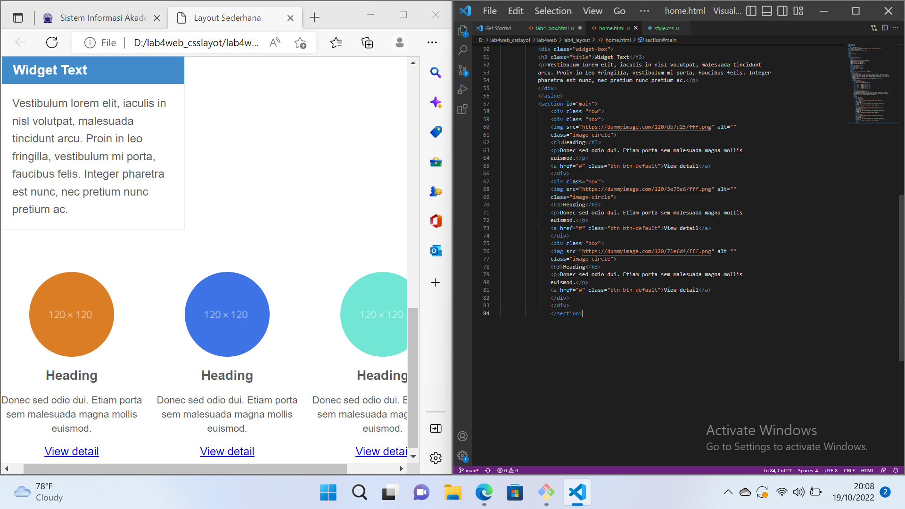

Gambar 11.Tampilan Content

**Menambahkan Content Artikel**<br>
Selanjutnya membuat content artikel. Tambahkan HTML berikut pada main content.<br>
```
<hr class="divider" />
<article class="entry">
 <h2>First featurette heading.</h2>
 
 <p>Lorem ipsum dolor sit amet, consectetur adipiscing elit. Vestibulum lorem 
elit, iaculis in nisl volutpat, malesuada tincidunt arcu. Proin in leo fringilla, 
vestibulum mi porta, faucibus felis. Integer pharetra est nunc, nec pretium nunc 
pretium ac.</p>
</article>
<hr class="divider" />
<article class="entry">
 <h2>First featurette heading.</h2>
 
 <p>Lorem ipsum dolor sit amet, consectetur adipiscing elit. Vestibulum lorem 
elit, iaculis in nisl volutpat, malesuada tincidunt arcu. Proin in leo fringilla, 
vestibulum mi porta, faucibus felis. Integer pharetra est nunc, nec pretium nunc 
pretium ac.</p>
</article>
```

Kemudian tambahkan CSS.<br>
```
.divider {
 border:0;
 border-top:1px solid #eeeeee;
 margin:40px 0;
}
/* entry */
.entry {
 margin: 15px 0;
}
.entry h2 {
 margin-bottom: 20px;
 }
.entry p {
 line-height: 25px;
}
.entry img {
 float: left;
 border-radius: 5px;
 margin-right: 15px;
}
.entry .right-img {
 float: right;
}
```
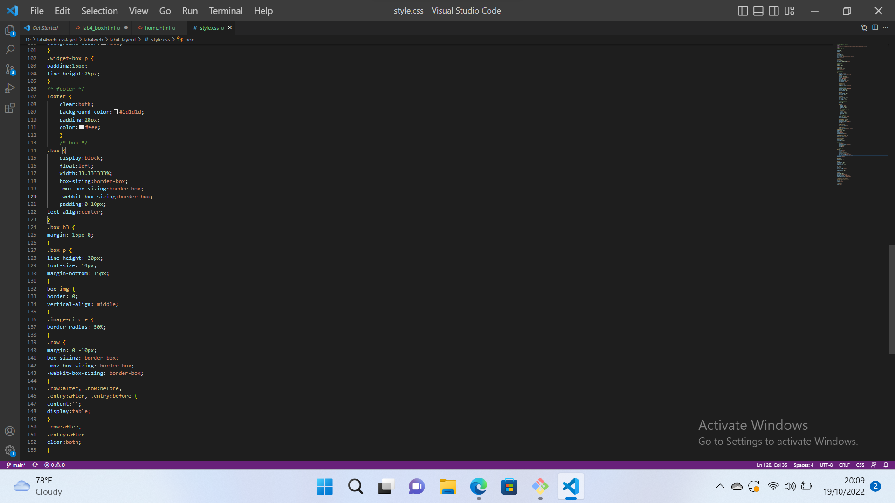

Berikut tampilan pada Browser :<br>

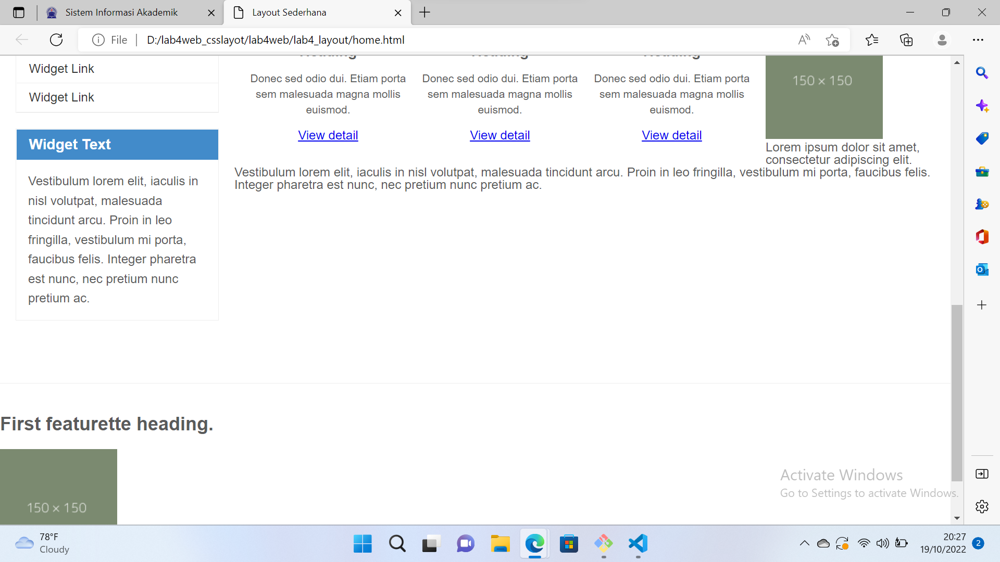

Gambar 12.Tampilan artikel

# Pertanyaan dan Tugas :

1. Tambahkan Layout untuk menu About<br>
=> buat single layout yang berisi deskripsi, portfolio, dll<br>
 >**Jawab:**
 > Membuat dokumen HTML dengan nama file about.html :<br>
 > Kemudian tambahkan CSS.<br>
 > 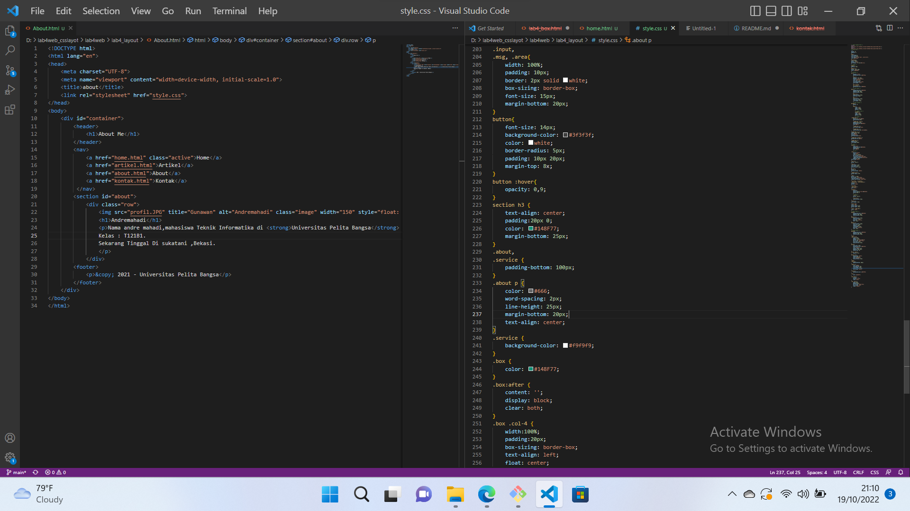<br>
 > Berikut tampilan pada Browser :<br>
 > 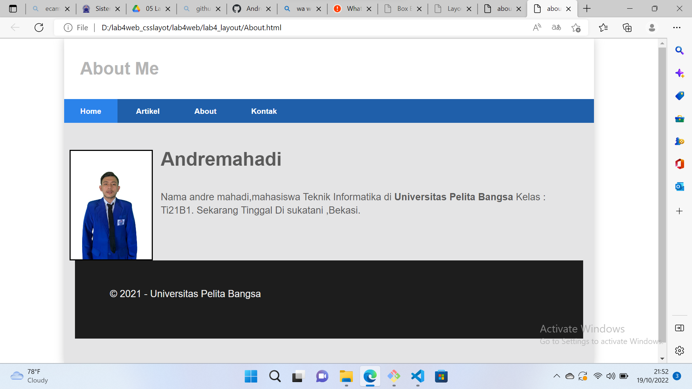<br>
 
2. Tambahkan layout untuk menu Contact<br>
=> yang berisi form isian: nama, email, message, dll.<br>
 >**Jawab:**
 > > Membuat dokumen HTML dengan nama file kontak.html :<br>
 > Kemudian tambahkan CSS.<br>
 > 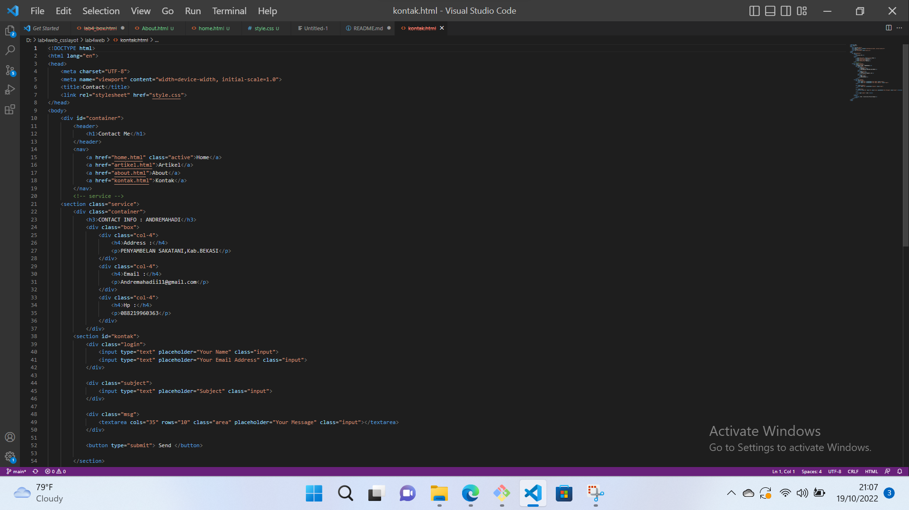<br>
 > Berikut tampilan pada Browser :<br>
 > 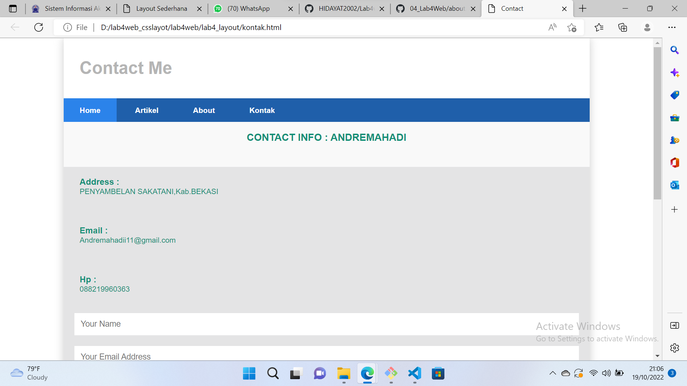<br>>

Cukup sekian Penjelasan dari saya.

**Terimakasih**


